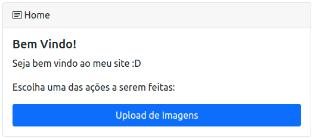
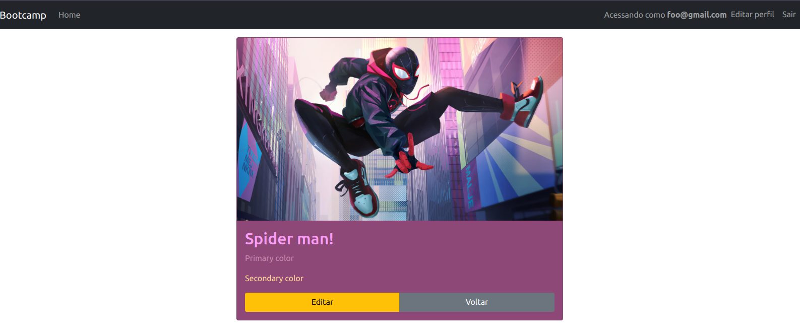
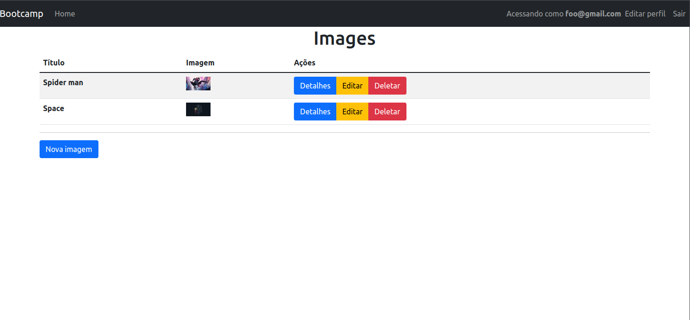

<h1 align="center" >Rails Bootcamp 🐙</h1>

<br/>
<p align="center">
  
</p>

<br/>

<p align="center">
  
  
   <br />
   <br />
</p>

<p align="center">
  <a href="#-projeto">Projeto</a>&nbsp;&nbsp;&nbsp;|&nbsp;&nbsp;&nbsp;
  <a href="#-tecnologias">Tecnologias</a>&nbsp;&nbsp;&nbsp;|&nbsp;&nbsp;&nbsp;
  <a href="#-material-de-apoio">Material de apoio</a>&nbsp;&nbsp;&nbsp;|&nbsp;&nbsp;&nbsp;
  <a href="#-como-baixar">Como baixar</a>&nbsp;&nbsp;&nbsp;|&nbsp;&nbsp;&nbsp;
  <a href="#-backlog"> Backlog </a>&nbsp;&nbsp;&nbsp;|&nbsp;&nbsp;&nbsp;
  <a href="#-aulas">Aulas</a>

---

## 💬 Projeto

<p align="justify">
  A ideia do projeto do bootcamp é principalmente promover e compartilhar conhecimento. O projeto foi concebido em uma arquitetura <i>MVC</i>, formado por autenticação/login com <i>Devise</i>, criação de usuários e o usuários consegue adicionar um banco de imagens com a ajuda do <i>ActiveStorage</i> e realizar o processamento de cores da imagem com <i>Sidekiq</i>.

  <p align="center">
    
  </p>

  <p align="center">
    
  </p>

</p>

---

## 🛠️ Tecnologias

<p align="justify">
  Abaixo estão algumas das tecnologias utilizadas durante o desenvolvimento do projeto. Ainda foi visado: Organizar o diretório da nossa aplicação de forma concisa e limpa. Escrever código limpo visando reutilização e eficiência.
</p>

<br>
<p align="center">
  
  
  
  
  
  
  
  
  
  
  

</p>

---

## 🗂 Material de apoio

- [ActiveStorage](https://guiarails.com.br/active_storage_overview.html)
- [Bootstrap](https://getbootstrap.com/docs/4.0/getting-started/introduction/)
- [Devise](https://github.com/heartcombo/devise)
- [Docker](https://docs.docker.com/get-docker/)
- [Docker-Hub](https://hub.docker.com/_/ruby)
- [Ruby on Rails](https://guides.rubyonrails.org/)
- [Sidekiq](https://github.com/mperham/sidekiq)

---

## ⬇️ Como baixar

```bash
  // Clonar repositório
  $ git clone https://github.com/douglasconstancio/bootcamp-ruby.git

  // Copie e edite `env.example`
  $ cp env.example .env

  // Ajuste a permissão dos `docker_entrypoint.sh`
  $ chmod +x entrypoints/docker_entrypoint.sh

  // Execute o build
  $ docker-compose build

  // Inicie os serviços docker
  $ docker-compose up -d # opcional: manter em segundo plano

  // Inicie o banco de dados
  $ docker-compose exec web rails db:setup

  // Caso queira executar todos os testes
  $ docker-compose exec web rails db:setup

  // Para rodar um arquivo de teste específico:
  $ docker-compose exec web rspec spec/models/image_spec.rb

  // Para rodar uma linha especifica de teste
  $ docker-compose exec web rspec spec/models/image_spec.rb:3
```
---

## 💭 Backlog

- 🟢 Melhorias visuais como espaçamento e estado de alguns botões
- ⛔️ Adicionar imagem no perfil
- ⛔️ Adicionar mais campos no cadastro do usuário
- ⛔️ Adicionar testes em geral

---

## 🚀 Aulas

  Este projeto foi criado/ministrado pelo [Diel](https://github.com/gustavodiel). O bootcamp é/está sendo um evento online com muito código, desafios, networking e aprendizado.

Ambiente criado seguindo [este tutorial](https://hackmd.io/@XBgk0kxlRnWrc48GVpMRVA/HJQeklI6t)

* [Aula 1](https://hackmd.io/UWCBZXZ-QvSW_zS_5_Bfog)
* [Aula 2](https://hackmd.io/RcwgP49yQlOV7sOdAaX2UQ)
* [Aula 3](https://hackmd.io/fbYkNFBOQk-Yl2MiWkw3gw)
* [Aula 4](https://hackmd.io/uOs-ccO8QgypgwaP4LbKKA)
* [Aula 5](https://hackmd.io/4hUGe1TmRVShHhUfu9amAw)

---
